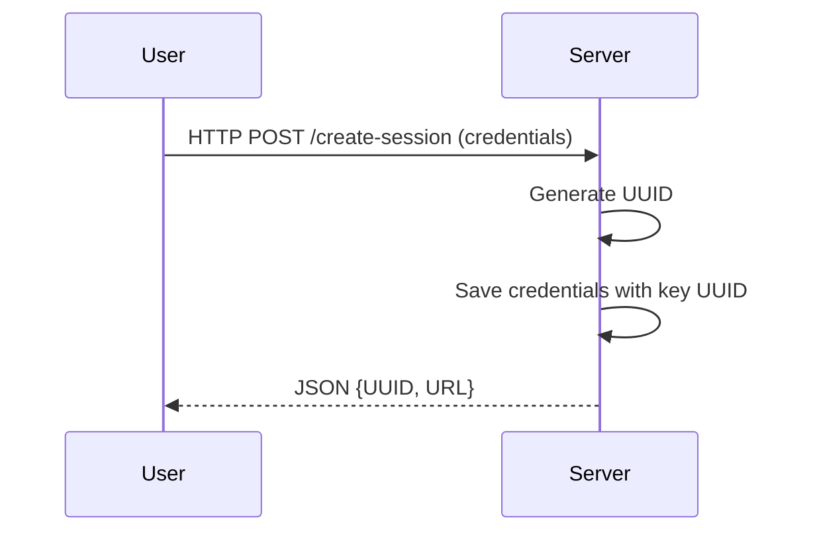
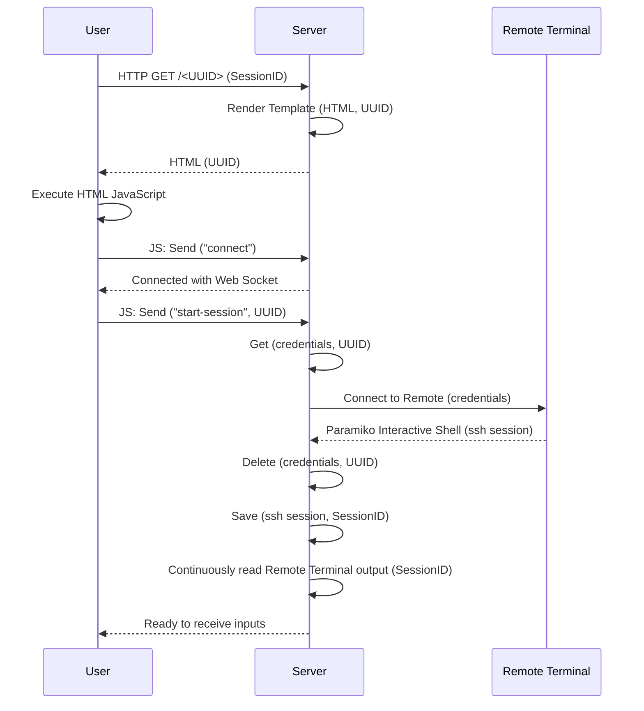
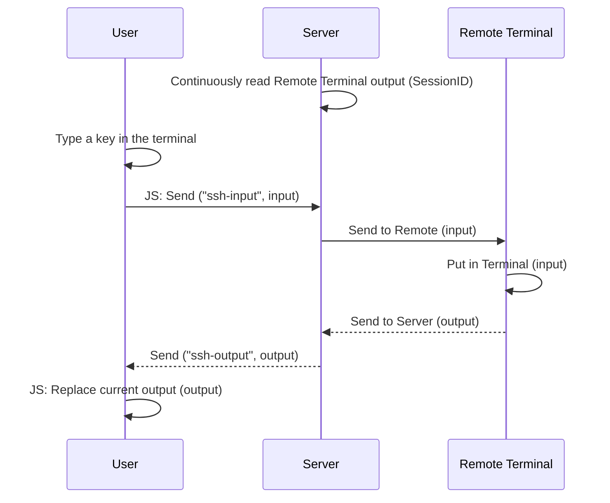

# alfresco-ssh
Inspired by: 
- [cs01/pyxtermjs](https://github.com/cs01/pyxtermjs) (used as a base structure)
- [huashengdun/webssh](https://github.com/huashengdun/webssh)

## How does it work
This project uses: 
- [Flask](https://flask.palletsprojects.com/en/stable/) as a web application framework
- [xterm.js](https://xtermjs.org/) to create a client terminal in the browser window of the user
- [Socket.IO](https://socket.io/) for bidirectional and low-latency communication between the browser and the sever (with WebSockets)
- [Flask-SocketIO](https://flask-socketio.readthedocs.io/en/latest/) to access the Socket.IO API from Python

### Create new Session
Prepares the connection by storing the credentials and generating a URL. 

### Start Session

Where `UUID` and `SessionID` are not the same:
- `UUID` is the one generated from the `create-session` process
- `SessionID` is the id of the connection with Flask

### Input/Output

The `input` is usually one character long. 
The only exceptions are some special keyboard keys (like the arrow keys).
