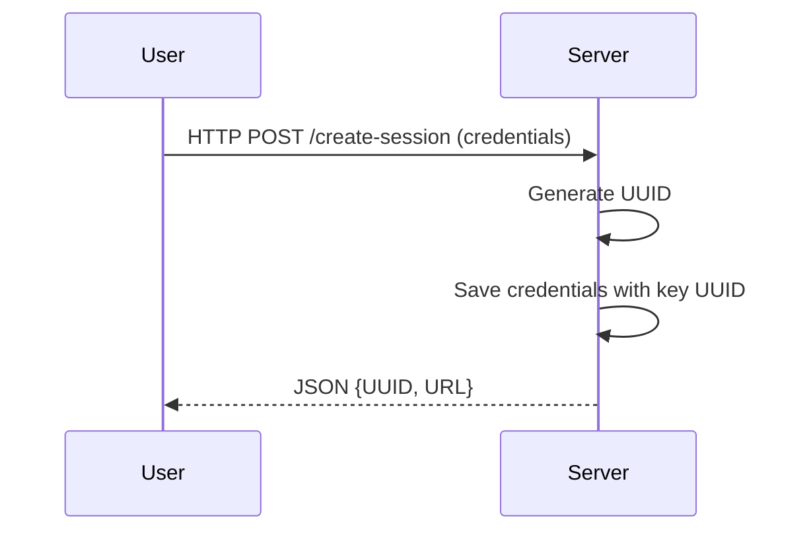
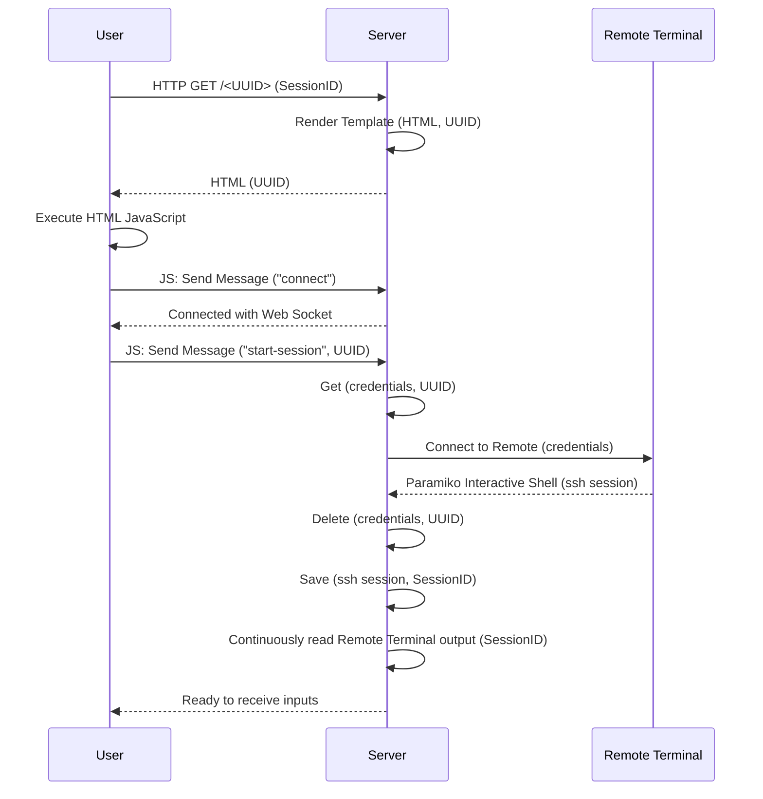
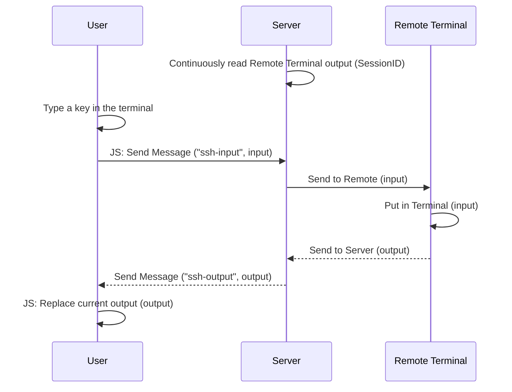
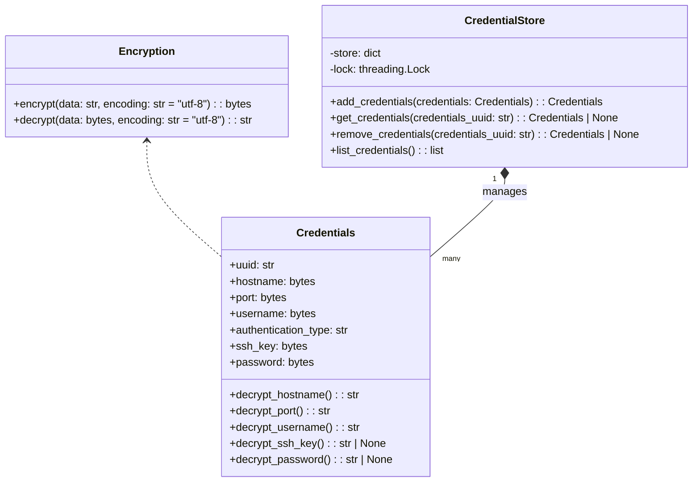
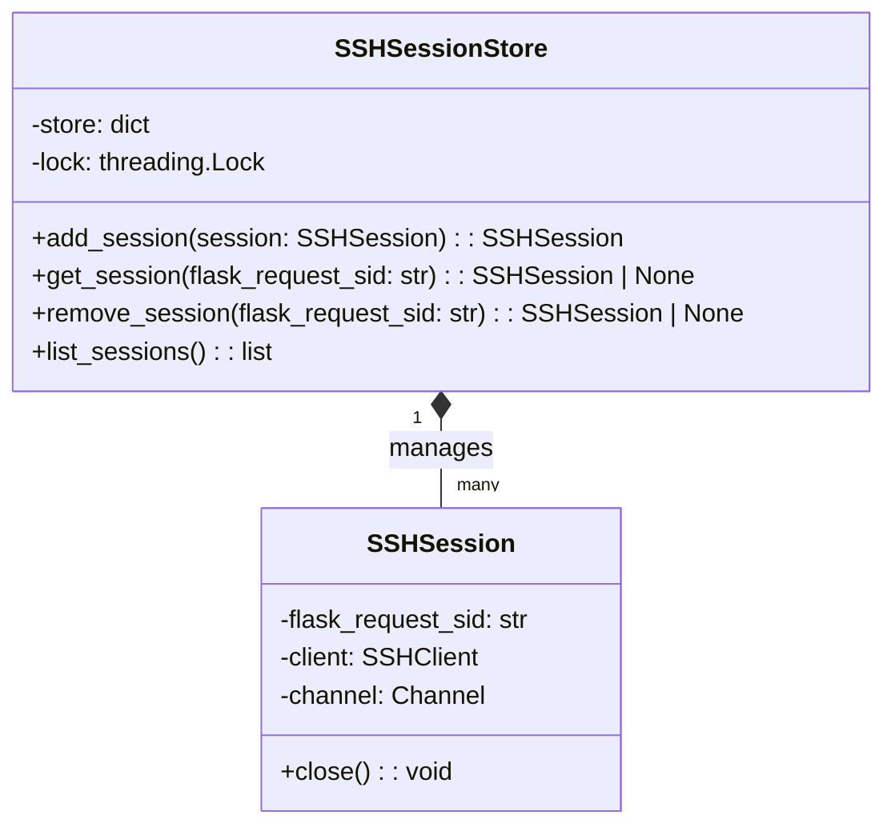

# alfresco-ssh
A web-based terminal emulator designed to facilitate remote SSH connections via a browser. 
Inspired by projects like [cs01/pyxtermjs](https://github.com/cs01/pyxtermjs) and [huashengdun/webssh](https://github.com/huashengdun/webssh), it combines a server-side Python 
implementation with a modern browser-based client interface.

It supports authentication with password and SSH keys.


## How to use it
### Start the server

```shell
python main.py [args]
```

The args are:
- `--port`: The port where the server runs (_default is 5000_)
- `--host`: The host where the server runs, there are two possible values:
    - `127.0.0.1`: The server will be only reachable on localhost (_default_)
    - `0.0.0.0`: The server will be reachable on the local network
- `--debug`: Debug the server
- `--version`: Prints the version of the program and exits

### Request a terminal
To request a terminal you can use any programming language that can send an HTTP request.

As an example, I will use Python with [requests](https://pypi.org/project/requests/).

#### Prepare the credentials for the SSH connection

You must have:
- `hostname`
- `port` (_if not provided, it is 22_)
- `username`
- `password` or `ssh_key` (_the SSH key will take priority_)

```python
data = {
  "hostname": "123.456.789.100",
  "port": 22,
  "username": "john_smith",
  "password": "my_password" # If you have to use the SSH key, omit this
}

# If you have used a password in data, omit this
files = {
  "ssh_key": b"my-ssh-key-bytes"
}
```

#### Make a POST HTTP request

It must be done to the `/create-session` endpoint, sending the credentials prepared before.

- If you have used a password, you must make an `application/json` request.
- If you have used an SSH key, you must make an `multipart/form-data` request.

In both cases, you will obtain a json containing either:
- `create_session_id` and `url`, where `url` is the terminal url for the new session
- `error`, if there is an error

```python
import requests
server_url = "http://127.0.0.1:5000"
endpoint = "/create-session"

# Request with password
response = requests.post(server_url + endpoint, data=data)

# Request with SSH key
response = requests.post(server_url + endpoint, data=data, files=files)
```

#### Use the terminal in the browser
You can take the `url` from the response json and use it directly in the browser.

```python
response_json = response.json()

if "error" in response_json:
  print(f"Error: {response_json["error"]}")
elif "url" in response_json:
  print(f"Success: {response_json["url"]}")
else:
  print(f"Unknown error")
```

It even works in an `<iframe>` HTML tag.

```html
<iframe src="the_url" width="800" height="600"></iframe>
```


## How does it work
This project uses: 
- [Flask](https://flask.palletsprojects.com/en/stable/) as a web application framework
- [xterm.js](https://xtermjs.org/) to create a client terminal in the browser window of the user
- [Socket.IO](https://socket.io/) for bidirectional and low-latency communication between the browser and the sever (with WebSockets)
- [Flask-SocketIO](https://flask-socketio.readthedocs.io/en/latest/) to access the Socket.IO API from Python

### Create new Session
Prepares the connection by storing the credentials and generating a URL. 


### Start Session


Where `UUID` and `SessionID` are not the same:
- `UUID` is the one generated from the `create-session` process
- `SessionID` is the id of the connection with Flask

### Input/Output


The `input` is usually one character long. 
The only exceptions are some special keyboard keys (like the arrow keys).


---
## Diagrams
### Models
#### Credentials


#### SSH Sessions
