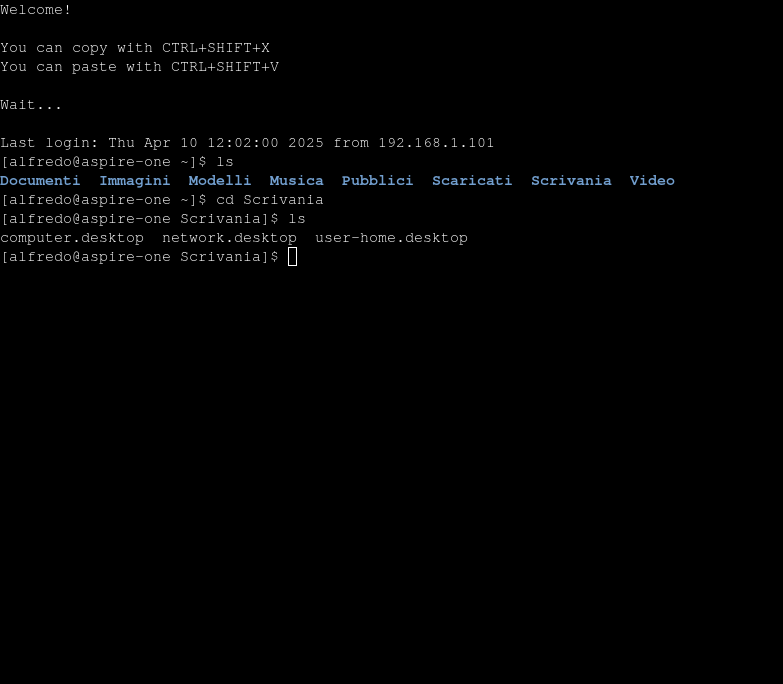

# alfresco-ssh

## Welcome
**alfresco-ssh** is a web-based terminal emulator designed to facilitate remote SSH connections via a browser. 
Inspired by projects like [cs01/pyxtermjs](https://github.com/cs01/pyxtermjs) and [huashengdun/webssh](https://github.com/huashengdun/webssh), it combines a server-side Python 
implementation with a browser-based terminal client interface.

## Features

- **Web-based SSH Terminal**: Access remote SSH sessions directly from your browser using a terminal emulator powered by [xterm.js](https://xtermjs.org/). 
- **Just like a normal terminal**: Supports command history with arrow keys and autocompletion with tab.
- **Password & SSH Key Authentication**: Supports both password and SSH private key authentication for connecting to remote servers.
- **Secure Credential Handling**: Credentials are encrypted in memory and never stored on disk.
- **Real-time Communication**: Utilizes [Flask-SocketIO](https://flask-socketio.readthedocs.io/) and [Socket.IO](https://socket.io/) for low-latency, bidirectional communication between the browser and server.
- **Responsive Terminal Resizing**: Automatically adjusts the terminal size to fit your browser window, with support for dynamic resizing events.
- **Clipboard Integration**: Easily copy and paste between your system clipboard and the terminal using keyboard shortcuts (`Ctrl+Shift+X` to copy, `Ctrl+Shift+V` to paste).
- **Timeout Handling**: Inactive sessions are automatically closed after a configurable period to enhance security.
- **Deployment Flexibility**: Supports both Docker-based and local development setups.
- **Iframe friendly**: The terminal is just an HTML page, so you can include it on other websites.

## Documentation

Full documentation and guides are available in the [Wiki](https://github.com/isislab-unisa/alfresco-ssh/wiki).

## Other modules
This project is part of a modular architecture called **VM Lab**. Find out more about it [here](https://github.com/isislab-unisa/vm-lab/wiki/The-External-Modules).

- [VM Lab](https://github.com/isislab-unisa/vm-lab)
- [SFTP Module](https://github.com/isislab-unisa/alfresco-sftp)

## Contributing

- See [Contributing-To-The-Wiki](https://github.com/isislab-unisa/alfresco-ssh/wiki/Contributing-To-The-Wiki) for documentation standards and contribution guidelines.
- Issues and feature requests are welcome!

## License

[MIT License](LICENSE)
